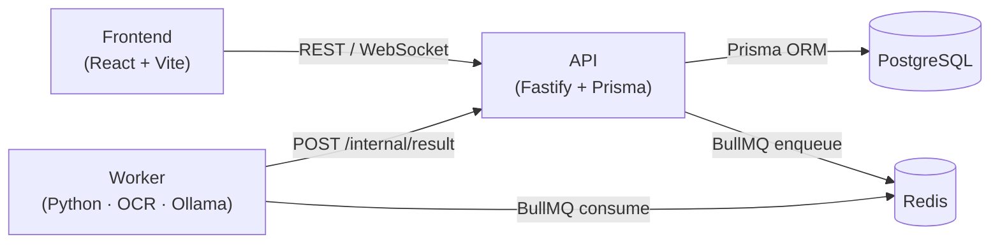
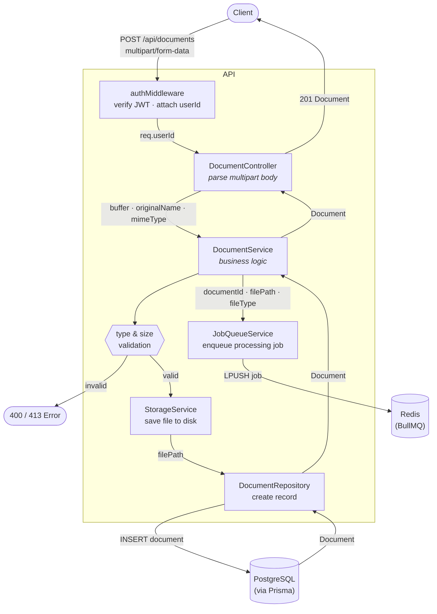
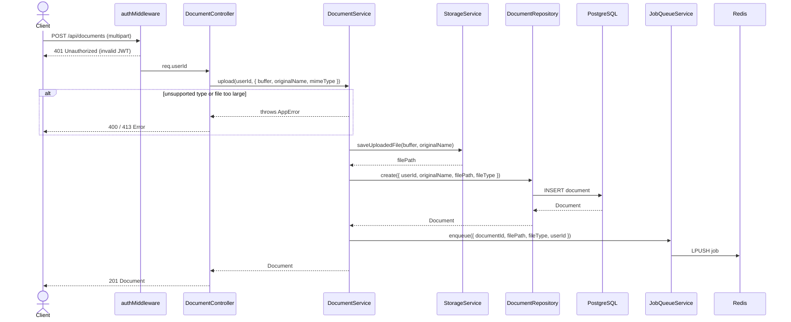

# AI Expense Classifier

Single-user application that ingests PDF bills or expense images, extracts
text via OCR or direct PDF parsing, classifies each expense through a local
LLM (Ollama), and surfaces results through a dashboard with charts, filters,
and Excel export.

## Stack

- **API** — TypeScript · Fastify · Prisma · BullMQ · JWT
- **Worker** — Python 3.11 · EasyOCR · pdfplumber · Ollama (`qwen2.5:7b-instruct-q3_K_M`)
- **Frontend** — React 18 · Vite · Material UI (MUI) · TanStack Query/Table · Recharts
- **Infra** — PostgreSQL · Redis · Docker Compose

## Architecture

### System overview



The Worker pulls jobs from Redis, runs OCR + LLM classification, then calls
back the API's internal route to persist the extracted expenses in Postgres.

### Request flow — `POST /api/documents`

This route illustrates the layered architecture used across the entire API:
**Controller → Service → Repository**, with Services orchestrating cross-cutting
concerns (storage, queue) and Repositories owning all database access via Prisma.





## Quick start

```bash
cp .env.example .env
docker compose -f docker-compose.dev.yml up
```

API: http://localhost:3000 · Frontend: http://localhost:5173 · Prisma Studio: http://localhost:5555

## Tests

```bash
# Unit (no infra)
docker compose -f docker-compose.dev.yml run --rm api npx vitest run
docker compose -f docker-compose.dev.yml run --rm worker pytest worker/tests -m "not integration"

# Integration (real Postgres/Redis/Ollama)
./scripts/run-integration-tests.sh
```
