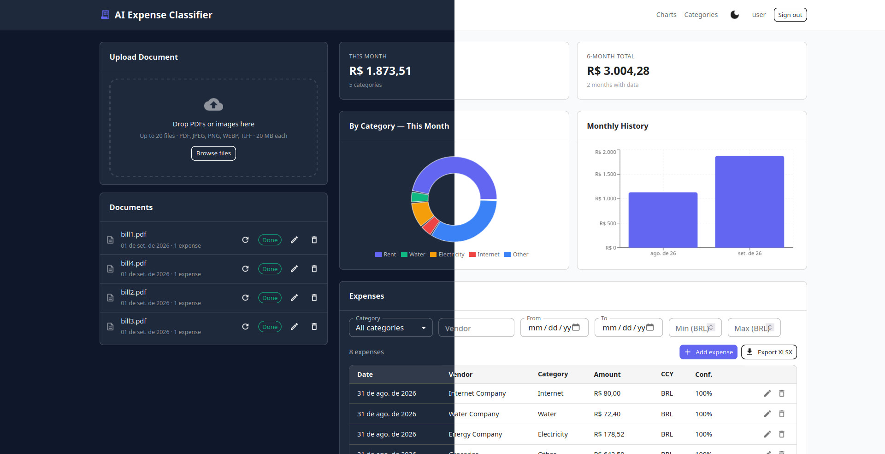
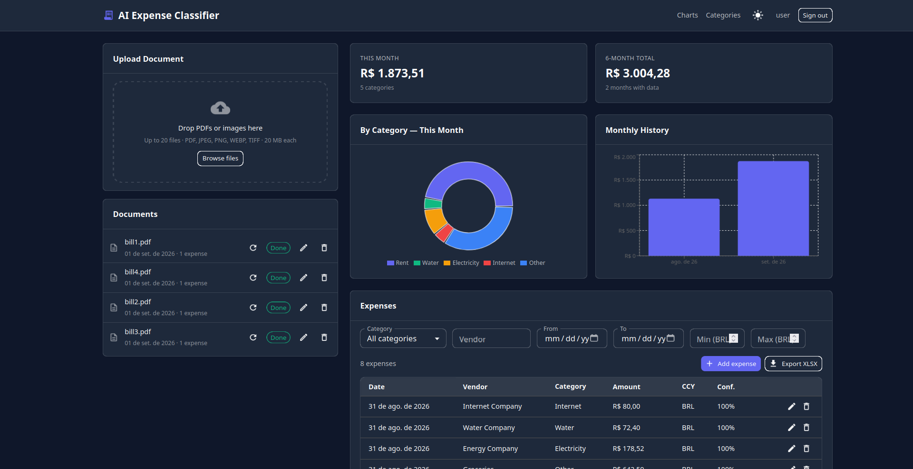
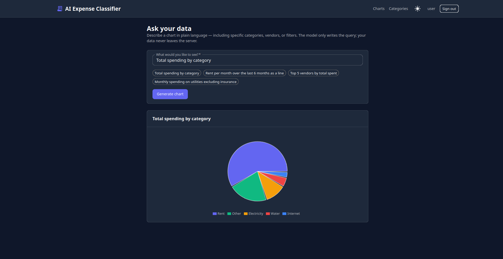
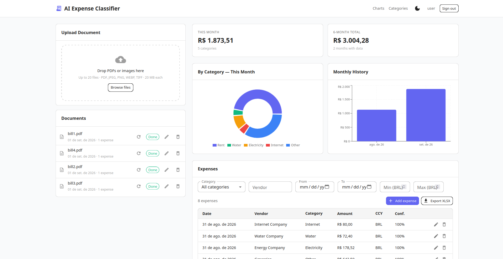
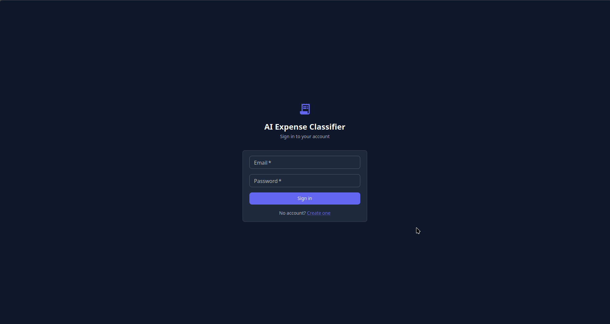
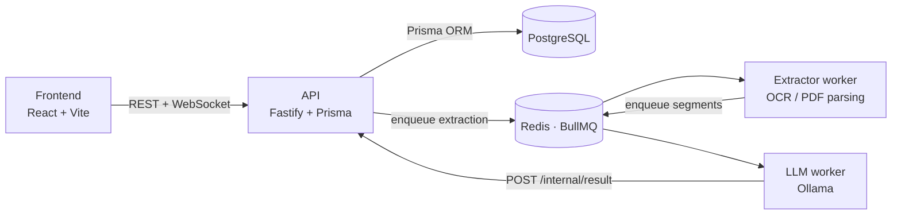
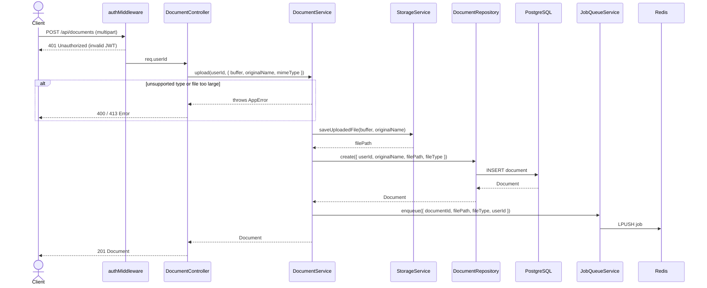

# AI Expense Classifier

Upload a bill — a scanned photo or a text PDF — and get a categorised expense in
your dashboard. The document is OCR'd or parsed, split per page, and classified
by a **local** LLM (Ollama); nothing leaves the machine. Results land in a
dashboard with charts, filters and Excel export, plus a natural-language chart
page where the model writes the query and Postgres enforces who may read what.

<p align="center">
  
</p>

## Contents

- [Highlights](#highlights)
- [Screenshots](#screenshots)
- [Stack](#stack)
- [Architecture](#architecture)
- [Ask your data — LLM-authored SQL, safely](#ask-your-data--llm-authored-sql-safely)
- [Quick start](#quick-start)
- [Tests](#tests)
- [Extraction benchmark](#extraction-benchmark)
- [Repository layout](#repository-layout)

## Highlights

Things in here I'd point at in an interview:

- **Two-stage async pipeline.** Extraction (CPU/GPU-bound OCR) and
  classification (LLM-bound) run as *separate* BullMQ consumers, so a slow OCR
  job never blocks the model queue and each half scales independently.
- **Pluggable extraction strategies.** `pdfplumber`, Docling, `pymupdf4llm` and
  EasyOCR sit behind one `IExtractionStrategy`; a factory picks per file
  (text-layer PDF vs. scanned) and a benchmark harness measures the trade-off on
  a 10-document ground-truth set.
- **LLM-authored SQL that can't escape its lane.** The natural-language chart
  page lets the model emit real SQL, executed as a `SELECT`-only Postgres role
  inside a read-only transaction under row-level security — see
  [below](#ask-your-data--llm-authored-sql-safely).
- **Bounded self-correction.** When the model's SQL fails, the Postgres error is
  fed back for up to two repair attempts before the request degrades to a safe
  compiled spec.
- **Layered API.** Controller → Service → Repository throughout, with every
  repository behind an interface, so the whole service layer unit-tests against
  fakes with no database.
- **67 test files** across Vitest (API) and pytest (worker), split into unit and
  infra-backed integration suites.
- **Live progress over WebSocket.** Queue events fan out through an event bus to
  a status updater and a WebSocket notifier — the document list updates itself.

## Screenshots

| Dashboard — upload, documents, expenses | Ask your data |
| --- | --- |
|  |  |
| Drop up to 20 PDFs/images, watch them process live, then filter and export. | Describe a chart in plain language; the model writes the query, the server runs it. |

| Light theme | Sign in |
| --- | --- |
|  |  |

## Stack

- **API** — TypeScript · Fastify · Prisma · BullMQ · JWT · WebSocket
- **Worker** — Python 3.11 · Docling / EasyOCR / pdfplumber / pymupdf4llm · Ollama (`qwen2.5:7b-instruct-q3_K_M`)
- **Frontend** — React 18 · Vite · Material UI · TanStack Query/Table · Recharts · Zustand
- **Infra** — PostgreSQL 16 · Redis 7 · Docker Compose

## Architecture

### System overview



The extractor pulls a document job, produces one text segment per page, and
enqueues classification. The LLM worker never touches the source file — it works
from those segments, then calls the API's internal route to persist expenses.

### Document pipeline

Each worker runs a chain of responsibility over a shared `DocumentContext`,
which makes every stage independently testable:

```
extractor worker    extraction → segmentation → validation → preprocessing
LLM worker          classification → postprocessing → persistence
```

### Request flow — `POST /api/documents`

This route shows the layered architecture used across the whole API:
**Controller → Service → Repository**, with services orchestrating cross-cutting
concerns (storage, queue) and repositories owning all database access.



## Ask your data — LLM-authored SQL, safely

The charts page takes free text ("top 5 vendors by total spent") and asks the
model for one of two answers:

1. **A whitelisted spec** — `{metric, groupBy, dateRange, chart}` drawn from
   tokens the server ships with the prompt, compiled by the API into a Prisma
   query. Preferred whenever it fits.
2. **Raw SQL** — for anything the spec can't express.

Raw SQL from a 7B model is only usable if it is *structurally* unable to do
damage, so isolation is enforced by the database rather than by trusting the
model:

| Control | Where |
| --- | --- |
| `SELECT`-only `chart_reader` role, granted just `Expense` and `Category` | [`migration.sql`](api/prisma/migrations/20260703000000_chart_reader_rls/migration.sql) |
| Row-level security keyed on a transaction-local `app.user_id` (default deny when unset) | same migration |
| `SET TRANSACTION READ ONLY` + `SET LOCAL statement_timeout = '3s'` | [`SqlChartRepository.ts`](api/src/repositories/SqlChartRepository.ts) |
| Query wrapped to force the `label`/`value` contract and a 500-row cap | same |
| `EXPLAIN` first — validates syntax, names and columns without executing | same |
| Up to 2 repair attempts, feeding the Postgres error back to the model | [`ChartService.ts`](api/src/services/ChartService.ts) |

The prompt is grounded on the user's own category names and today's date, with
few-shot examples — small models get date arithmetic and category filtering
wrong far more often from instructions alone.

## Quick start

Requires Docker with Compose. An NVIDIA GPU is optional (`DOCLING_DEVICE=cuda`);
everything runs on CPU by default.

```bash
cp .env.example .env
docker compose -f docker-compose.dev.yml up
```

Then pull the model once:

```bash
docker compose -f docker-compose.dev.yml exec ollama ollama pull qwen2.5:7b-instruct-q3_K_M
```

| Service | URL |
| --- | --- |
| Frontend | http://localhost:5173 |
| API | http://localhost:3000 |
| Prisma Studio | http://localhost:5555 |

Register a user in the UI, then drop one of the sample bills from
[`assets/`](assets) onto the dashboard.

## Tests

```bash
# Unit — no infrastructure needed
docker compose -f docker-compose.dev.yml run --rm api npx vitest run
docker compose -f docker-compose.dev.yml run --rm worker pytest worker/tests -m "not integration"

# Integration — real Postgres, Redis and Ollama
./scripts/run-integration-tests.sh
```

## Extraction benchmark

[`worker/benchmarks/extraction_benchmark.py`](worker/benchmarks/extraction_benchmark.py)
compares every extraction engine (default / Docling / pymupdf4llm, CPU and GPU)
over the 10 bills in [`assets/`](assets) — each present as both a text-native and
a scanned-image PDF — scoring two ways:

- **fidelity** — do the known values survive in the raw extracted text?
- **e2e** — run the real pipeline through Ollama and set-match the resulting
  expenses against [`ground_truth.json`](assets/ground_truth.json).

```bash
docker compose -f docker-compose.dev.yml run --rm -e PYTHONPATH=/app worker \
  python benchmarks/extraction_benchmark.py
```

## Repository layout

```
api/        Fastify + Prisma service — controllers, services, repositories, schemas
  prisma/   Schema and migrations (incl. the chart_reader RLS migration)
  tests/    Vitest unit, integration and e2e suites
worker/     Python pipeline — extraction, segmentation, classification, charts
  benchmarks/  Extraction-engine testbench
  tests/       pytest unit and integration suites
frontend/   React + Vite SPA
assets/     Sample bills and ground truth
scripts/    Integration-test runner
```
